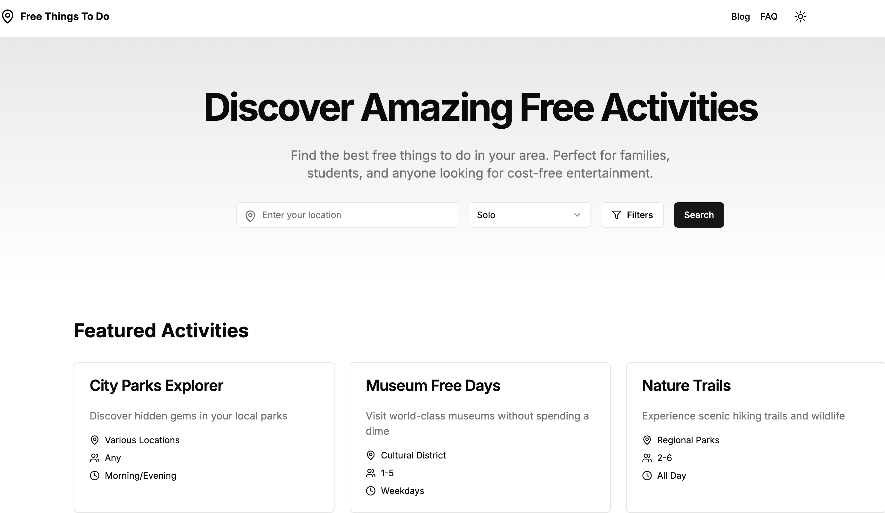

# Free Things To Do - Project Requirements Document

## Project Overview
A modern web platform that helps users discover free activities based on their location, group size, and preferences. The platform aims to provide personalized recommendations for free activities and entertainment options.

## Core Features

### 1. Activity Recommendation Engine
- **Input Requirements**
  - Location (Required)
  - Number of people (Required)
  - Additional preferences (Optional)
    - Indoor/Outdoor preference
    - Activity type
    - Time of day
    - Accessibility requirements

- **AI Integration**
  - System will utilize AI API for generating recommendations
  - Process flow:
    1. Collect user inputs and preferences
    2. Format data with custom-designed prompt template
    3. Send to AI API for processing
    4. Receive and parse AI response
    5. Display formatted recommendations to user
  - AI will generate contextual and personalized recommendations based on:
    - User provided information
    - Local context (weather, season, time)
    - Activity database
    - Previous user feedback
  - Each AI response will include 5 structured recommendations

- **Output Format**
  - Display 5 recommended activities at a time
  - Each recommendation includes:
    - Activity name
    - Brief description
    - Location details
    - Best time to visit
    - Additional relevant information
  - Option to generate 5 more recommendations if needed

### 2. Website Structure

#### Landing Page
- Clean, modern design
- Prominent search/input section
- Quick access to popular locations
- Featured activities section
- Clear call-to-action buttons
- Mobile-responsive design

#### Blog Section
- Regular content updates about free activities
- Categories:
  - Location-based activities
  - Seasonal activities
  - Family activities
  - Student activities
  - Indoor activities
  - Outdoor activities
- Share functionality
- Comment section

#### FAQ Section
- Searchable FAQ database
- Common questions about:
  - How to use the platform
  - Activity suggestions
  - Location-specific information
  - Platform features
  - User guidelines

## User Experience Requirements
- Intuitive navigation
- Fast loading times
- Mobile-first design
- Easy-to-use input forms
- Clear and concise activity descriptions
- Simple feedback mechanism

## SEO Requirements
- Keyword focus: "free things to do"
- Optimized URL structure
- Meta descriptions and titles
- Alt text for images
- Structured data implementation
- Mobile optimization
- Location-based SEO
- Internal linking strategy

## Content Requirements
- High-quality, original content
- Regular blog updates
- Location-specific guides
- Seasonal activity updates
- User-generated content integration
- Image guidelines and standards

## Future Considerations
- User accounts and preferences
- Activity ratings and reviews
- Social sharing features
- Email notifications
- Mobile app development
- Multiple language support
- Integration with local event APIs
- Weather integration for outdoor activities
